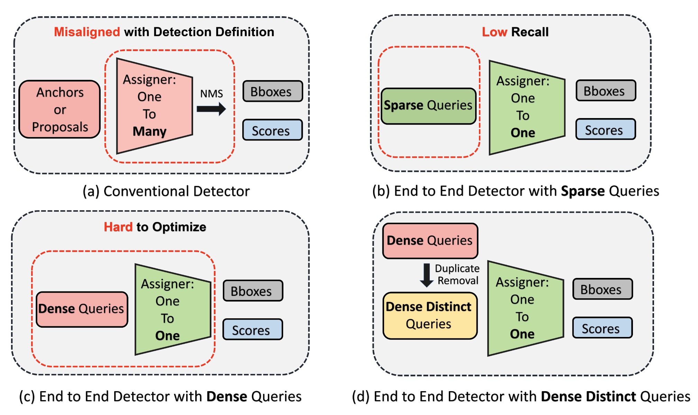

## [Dense Distinct Query for End-to-End Object Detection](https://arxiv.org/abs/2303.12776) (CVPR2023)
By Shilong Zhang*, Xinjiang Wang*, Jiaqi Wang, Jiangmiao Pang, Chengqi Lyu, Wenwei Zhang, Ping Luo, Kai Chen


### Updates
21/3/2023: DDQ DETR(12 epoch 52.1 mAP) has been released at _**ddq_detr**_ branch. Please run ```git checkout ddq_detr```  to use it.

20/3/2023: DDQ FCN and DDQ R-CNN has been released at **_main_** branch


### Abstract:

One-to-one label assignment in object detection has successfully obviated the need of non-maximum suppression (NMS) as a postprocessing
 and makes the pipeline end-to-end. However, it triggers a new dilemma as the widely used sparse queries cannot guarantee a high recall, while dense queries inevitably bring more similar queries and encounters optimization difficulty. As both sparse and dense queries are problematic, then what are the expected queries in end-to-end object detection? This paper shows that the solution should be Dense Distinct Queries (DDQ). Concretely, we first lay dense queries like traditional detectors and then select distinct ones for one-to-one assignments. DDQ blends the advantages of traditional and recent end-to-end detectors and significantly improves the performance of various detectors including FCN, R-CNN, and DETRs. Most impressively, ddq_detr achieves 52.1 AP on MS-COCO dataset within 12 epochs using a ResNet-50 backbone, outperforming all existing detectors in the same setting. DDQ also shares the benefit of end-to-end detectors in crowded scenes and achieves 93.8 AP on CrowdHuman. We hope DDQ can inspire researchers to consider the complementarity between traditional methods and end-to-end detectors.


[//]: # (### Updates)

[//]: # (DDQ DETR has been released at ddq_detr branch &#40;21/3/2023&#41;)

[//]: # ()
[//]: # (DDQ FCN and DDQ R-CNN has been released &#40;20/3/2023&#41;)

### NOTE
1. The  DDQ FCN/RCNN was implemented based on mmdetection2.0, which has been released in this **_main_** branch . 

2. DDQ DETR is implemented based on mmdetection3.0. You need to switch to the **_ddq_detr_** branch of this repo.

#### All our implementation can be find in projects directory.

### Install 
####  DDQ FCN&R-CNN
DDQ FCN and DDQ R-CNN has been fully tested under [MMDetection V2.22.0](https://github.com/open-mmlab/mmdetection/releases/tag/v2.22.0) and [MMCV V1.4.7](https://github.com/open-mmlab/mmcv/releases/tag/v1.4.7) under  **torch 1.9.0+cu111**, other versions may not be compatible.
We include the necessary source code of MMCV and MMDetection in this repo, you can build the MMCV by following command.

```bash
cd mmcv-1.4.7
MMCV_WITH_OPS=1 python setup.py build_ext --inplace
ln -s mmcv-1.4.7/mmcv ./
cd ..
export PYTHONPATH=`pwd`:$PYTHONPATH
```

####  DDQ DETR
DDQ DETR has been fully tested under [MMDetection V3.0.0rc6](https://github.com/open-mmlab/mmdetection/releases/tag/v3.0.0rc6), [MMCV v2.0.0rc4](https://github.com/open-mmlab/mmcv/releases/tag/v2.0.0rc4) and [MMEngine v0.6.0](https://github.com/open-mmlab/mmengine/releases/tag/v0.6.0) under  **torch 1.9.0+cu111**, other versions may not be compatible.
We include the necessary source code of MMCV, MMDetection and MMEngine in the **_ddq_detr_** branch of this repo, you just need to build the MMCV by following command.

```bash
git check ddq_detr
cd mmcv-2.0.0rc4
MMCV_WITH_OPS=1 python setup.py build_ext --inplace
ln -s mmcv-2.0.0rc4/mmcv ./
cd ..
export PYTHONPATH=`pwd`:$PYTHONPATH
```


### Prepare the dataset

```text
DDQ
├── data
│   ├── coco
│   │   ├── annotations
│   │   │      ├──instances_train2017.json
│   │   │      ├──instances_val2017.json
│   │   ├── train2017
│   │   ├── val2017
```


### Train and Test
8 is the number of gpus.
##### For slurm

Train
```shell
GPUS=8 sh tools/slurm_train.sh partition_name  job_name projects/configs/ddq_fcn/ddq_fcn_r50_1x.py  ./exp/ddq-fcn
```

Test
```shell
GPUS=8 sh tools/slurm_test.sh partition_name  job_name  projects/configs/ddq_fcn/ddq_fcn_r50_1x.py   path_to_checkpoint --eval bbox
```
##### For Pytorch distributed

Train
```shell
sh tools/train.sh projects/configs/ddq_fcn/ddq_fcn_r50_1x.py 8 ./exp/ddq_fcn
```
Test
```shell
sh tools/test.sh  projects/configs/ddq_fcn/ddq_fcn_r50_1x.py  path_to_checkpoint 8 --eval bbox
```


#### Results & Checkpoints
We find that the performance is unstable and may fluctuate by about 0.2 mAP.

|      Model      | Backbone | Lr schd | Augmentation | box AP(val) | Model |                                                                                                 log                                                                                                 |
|:---------------:|:--------:|:-------:|:------------:|:-----------:|:------: |:---------------------------------------------------------------------------------------------------------------------------------------------------------------------------------------------------:|
|     DDQ FCN     | R-50 |   12e   |    Normal    |    41.5     | [ckpt](https://drive.google.com/file/d/1R0cIA9HP3nysCN5QgNr0Vik4Yru5LsAb/view?usp=share_link) |[log](https://drive.google.com/file/d/1PU2sPwthtFWfGeAC0CoRbMUQWYYEHqBJ/view?usp=share_link)|
|     DDQ FCN     | R-50 |   36e   |     DETR     |    44.8     | [ckpt](https://drive.google.com/file/d/1ePfznTa1Q3HSPVaZNQg4ega2QFKpmS7x/view?usp=share_link) |[log](https://drive.google.com/file/d/1kvRx94YZy8Fo7cYipwBCXEKL5hQdxSgG/view?usp=share_link)|
|    DDQ R-CNN    | R-50 |   12e   |    Normal    |    44.6     | [ckpt](https://drive.google.com/file/d/17WbzELx0j2XAlvgN6uNewPqq21Sk1dDW/view?usp=share_link) |[log](https://drive.google.com/file/d/1PrjRzU890LIL3cYSukLBmoEq6q8kPLPq/view?usp=share_link)|
|    DDQ R-CNN    | R-50 |   36e   |     DETR     |    48.1     | [ckpt](https://drive.google.com/file/d/1KsIzoZPGcFFifNQLrtWoT5UZIl4ee63E/view?usp=share_link) |[log](https://drive.google.com/file/d/1EVtyJDzpV-HwEtLRs98CgQBB59logGkW/view?usp=share_link)|


##### Please ```git checkout ddq_detr``` and follow the install instruction to use following checkpoint

|      Model      | Backbone | Lr schd | Augmentation |     box AP(val)     | Model | log |
|:---------------:|:--------:|:-------:|:------------:|:-------------------:|:------: |:------: |
| DDQ DETR-4scale | R-50 |   12e   |     DETR     |        51.3         | [ckpt](https://drive.google.com/file/d/1V5Uqf6Q3FcCyzj--XxrbCKLm3mmGyJ0h/view?usp=share_link) | [log](https://drive.google.com/file/d/1wHbHxDVG8FiNHLwTUAV_tH-7WYIoBxSr/view?usp=share_link) |
| DDQ DETR-5scale | R-50 |   12e   |     DETR     |        52.1         | [ckpt](https://drive.google.com/file/d/1AZLrtj4v4puj9Un7yYqL8LVInIGQYcht/view?usp=share_link) | [log](https://drive.google.com/file/d/1FVmvkL0Q_G_DjqH8itpDx89CWyaplMnc/view?usp=share_link) |
| DDQ DETR-4scale |  Swin-L  |   30e   |     DETR     |        58.7         | [ckpt](https://drive.google.com/file/d/1kmLt9K59ZRfXwU1Ip6-nYjBQ7V-w2_LI/view?usp=share_link) | [log](https://drive.google.com/file/d/1hQtplhMQITDIsI7oigy36G06NARq-UCx/view?usp=share_link) |
